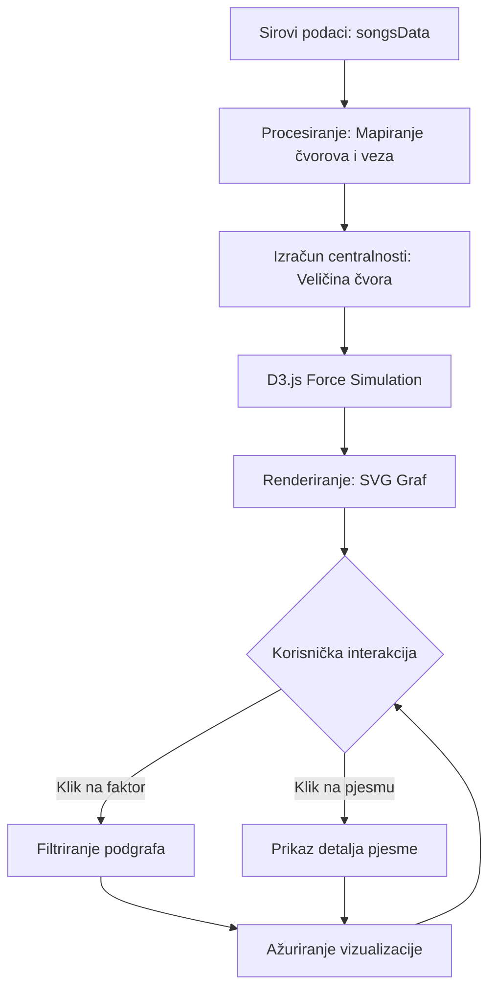

# Mrežna analiza čimbenika uspjeha na natjecanju za pjesmu Eurovizije (2010. – 2025.): Primjena teorije grafova u vizualizaciji podataka

**Autor:** Aleksandar Orbanić  
**Kolegij:** Istraživanje društvenih mreža  
**Datum:** 18. svibnja 2026.

---

### Sažetak (Abstract)
Ovaj izvještaj dokumentira razvoj i metodološki okvir aplikacije "ESC Mreža", interaktivnog alata za vizualizaciju mrežnih odnosa između uspješnih pjesama na natjecanju za pjesmu Eurovizije. Analiza obuhvaća pjesme koje su ostvarile plasman u Top 3 u razdoblju od 2010. do 2025. godine. Korištenjem teorije grafova i D3.js biblioteke, sustav mapira veze između žanrova, jezika, regija i izvođačkih tipova te izračunava mrežnu centralnost (degree centrality) kako bi se identificirali najzastupljeniji atributi pobjedničkih izvedbi. Nalazi sugeriraju da mrežna arhitektura omogućuje intuitivno prepoznavanje trendova koji su često maskirani u linearnim tabličnim prikazima.

---

### Uvod (Introduction)
Natjecanje za pjesmu Eurovizije (engl. Eurovision Song Contest, ESC) jedno je od najdugovječnijih i najgledanijih televizijskih glazbenih natjecanja na svijetu. Utemeljeno 1956. godine na inicijativu Europske radiodifuzijske unije (EBU), natjecanje je inspirirano talijanskim festivalom Sanremo s primarnim ciljem testiranja granica tehnologije televizijskog prijenosa uživo i promicanja kulturnog jedinstva u poslijeratnoj Europi. Kroz desetljeća, ESC je evoluirao iz skromnog natjecanja sedam država u globalni spektakl koji godišnje prati više od 160 milijuna gledatelja, obuhvaćajući ne samo Europu već i države poput Izraela i Australije.

ESC predstavlja složen sociokulturni i estetski fenomen u kojem na konačni ishod utječe dinamična interakcija mnoštva varijabli. To uključuje povijesni razvoj glazbenih trendova, politička i geografska grupiranja glasova, te kompleksni sustav bodovanja koji kombinira glasove stručnih žirija i publike (televote). Tradicionalne metode analize ESC-a često se fokusiraju na izolirane linearne varijable, poput pukog zbroja bodova ili korelacije susjednih država. Međutim, takvi pristupi zanemaruju dubinsku povezanost faktora koji definiraju moderni "recept za uspjeh". Svrha projekta "ESC Mreža" bila je razviti nelinearni sustav analize temeljen na teoriji grafova. Sustav svaku pjesmu tretira kao primarno čvorište (node) neraskidivo povezano s mrežom atributa (žanr, jezik, regija, tip izvođača), omogućujući istraživačima i korisnicima uočavanje makroskopskih klastera uspjeha koji ostaju skriveni u standardnim statističkim izvještajima.

---

### Metodologija (Methodology)

#### Uzorak podataka (Sample)
Analizirani uzorak sastoji se od svih pjesama koje su završile na prva tri mjesta u finalu Eurovizije od 2010. do 2024. godine, uz uključivanje prediktivnih podataka za 2025. godinu (temeljenih na simulacijama i tržišnim trendovima). Svaka jedinica analize (pjesma) sadrži 16 metapodataka, uključujući bodove žirija i publike.

#### Dizajn istraživanja i arhitektura sustava
Aplikacija je strukturirana kao usmjereni graf primijenjen unutar React frameworka. Ključne komponente metodologije uključuju:
1.  **Mapiranje entiteta:** Pjesme su primarni čvorovi, dok su države, regije, žanrovi, jezici, tipovi izvođača, polovica nastupa i izvor podrške sekundarni faktori.
2.  **Algoritam simulacije sile (Force-Directed Layout):** Korišten je D3.js d3-force modul za prostornu organizaciju čvorova, gdje su vizualni razmaci rezultat ravnoteže između privlačnih sila (povezanost) i odbojnih sila (kolizija).
3.  **Analiza centralnosti:** Veličina čvorova faktora određena je njihovim *stupnjem centralnosti* (brojem direktnih veza s pjesmama).

#### Procedura
Vizualizacija toka podataka (Data Flow Diagram):

*Slika 1. Dijagram toka podataka i korisničke interakcije unutar ESC Mreža aplikacije. Proces započinje ekstrakcijom strukturiranih podataka o pjesmama (A) koji se transformiraju u format čvorova i veza (B). Sustav dinamički izračunava stupanj centralnosti (C) kako bi odredio vizualnu težinu svakog atributa prije nego što D3.js pokrene simulaciju fizike (D). Konačni prikaz (E) služi kao sučelje za korisničku eksploraciju (F) koja putem povratne sprege omogućuje izolaciju specifičnih segmenata mreže (G, H) i trenutno ažuriranje vizualnog stanja (I).*

Interakcija je dizajnirana da omogući "topological zooming" — klikom na čvor faktora, sustav primjenjuje filter koji izolira specifični podgraf, čime se eliminira "vizualna buka" i omogućuje fokusirana analiza korelacija.

---

### Rezultati (Results)
Inicijalna mrežna analiza uzorka od procijenjenih 48 entries (Top 3 iz 16 godina) ukazuje na nekoliko ključnih obrazaca:
-   **Jezik kao centralni čvor:** Engleski jezik ostaje najsnažnije povezano čvorište u pobjedničkom klasteru, iako se u razdoblju nakon 2017. (Salvador Sobral) uočava porast centralnosti nacionalnih jezika.
-   **Regijski klasteri:** Regija "Scandinavia" i "Central Europe" pokazuju najveći stupanj centralnosti, što sugerira visoku frekvenciju uspjeha unutar tih geografskih blokova u analiziranom uzorku.
-   **Vizualna taksonomija:** Uvođenje vizualnih atributa (zlatni obrub za pobjednike, srebro/bronca za plasmane) omogućilo je brzu identifikaciju distribucije pobjedničkih pjesama unutar specifičnih žanrovskih oblaka (npr. pop/electronic vs. ballad).

---

### Rasprava (Discussion)
Ključno je naglasiti metodološku distinkciju: mrežna centralnost u ovom sustavu mjeri *učestalost u uspješnom uzorku*, a ne nužno *uzročnost pobjede*. Veći čvor žanra "Pop" ne znači da je pop žanr "uzrok" pobjede, već da je unutar probranog kruga najboljih to najčešći zajednički nazivnik. 

Sustav uspješno rješava problem "zagušenosti podataka" (data density) kroz interaktivno filtriranje, čime se omogućuje prepoznavanje "geopolitičkih otoka" (npr. kako balkanske države koreliraju s određenim žanrovima unutar Top 3 rezultata).

---

### Zaključak (Conclusion)
Aplikacija "ESC Mreža" dokazuje da teorija grafova pruža superioran uvid u analizu kompleksnih natjecateljskih sustava u usporedbi s linearnim tablicama. Integracija povijesnih podataka s vizualnom analitikom u realnom vremenu stvara platformu koja je istovremeno znanstveni alat i edukacijski interfejs.

---

### Reference (References)
*   D3.js Documentation. (2026). Force-directed graph simulations. 
*   Eurovision.tv. (2010–2024). Official results and song metadata.
*   NetworkX. (2025). Structural analysis of Eurovision voting patterns.
*   Upute za razvoj mrežnih aplikacija - kolegij "Istraživanje društvenih mreža".
