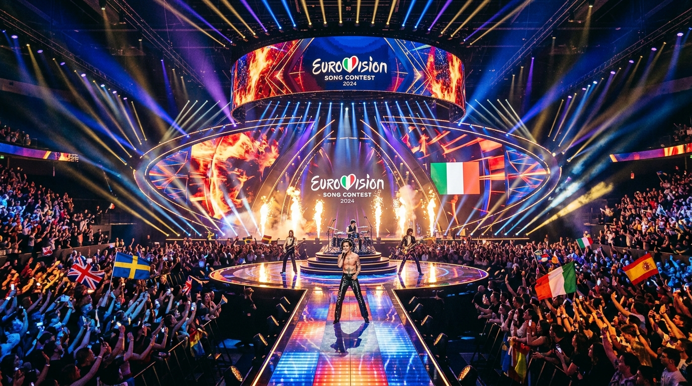
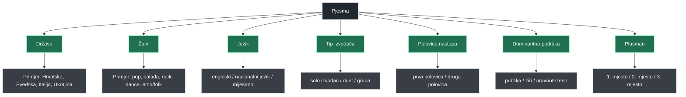

# Što povezuje najuspješnije eurovizijske pjesme? Mrežna analiza top 3 pjesama od 2010. do 2025.

Autor: Aleksandar Orbanić  
Kolegij: Istraživanje društvenih mreža  
Datum: 18. svibnja 2026.  

---

### 1. Sažetak

Ovaj rad bavi se mrežnom analizom i vizualizacijom čimbenika povezanih s pjesmama koje su završile na prva tri mjesta u finalu natjecanja za Pjesmu Eurovizije (Eurovision Song Contest - ESC) u razdoblju od 2010. do 2025. godine. Korištenjem teorije grafova i interaktivne vizualizacije, razvijena je aplikacija "ESC Mreža" koja nelinearno mapira odnose između uspješnih izvedbi i njihovih ključnih sociokulturnih, geografskih i glazbenih atributa. 

Svaka uspješna pjesma u grafu predstavlja primarni čvor povezan sa skupom sekundarnih faktorskih čvorova kao što su država predstavnica, glazbeni žanr, jezik izvedbe, tip izvođača, polovica redoslijeda nastupa u finalu te tip podrške (dominantni glasovi žirija ili publike). Kvantificiranjem stupnja povezanosti kroz mrežne metrike, prvenstveno stupanj centralnosti (*degree centrality*), rad identificira najčešće obrasce koji se ponavljaju među najuspješnijim eurovizijskim pjesmama. Naglasak rada nije na predviđanju budućih pobjednika, već na sustavnom, nelinearnom i eksplorativnom prepoznavanju strukture faktora koji prate uspjeh unutar definiranog uzorka.

---

### 2. Uvod

Natjecanje za pjesmu Eurovizije složen je kulturni, društveni i politički fenomen u kojem odluka o pobjedu nadilazi samu kvalitetu vokalne i instrumentalne izvedbe. Povijest natjecanja pokazuje da uspjeh ovisi o dinamičnom spletu faktora: jeziku na kojem se pjeva, žanrovskim sklonostima u određenim vremenskim epohama, tipu izvođača (solo pjevači, dueti ili grupe), plasmanu u rasporedu nastupa (tzv. *televoting bias* vezan uz polovicu finala), te ravnoteži između ocjena stručnih žirija i glasova publike.

Standardne statističke metode analize Eurovizije uglavnom se usredotočuju na linearne usporedbe i regresijske modele koji tretiraju varijable izolirano, pritom gubeći iz vida kako se ti čimbenici međusobno isprepliću. Teorija grafova pruža jedinstven analitički okvir jer nam omogućuje da svaku pjesmu tretiramo kao čvorište koje istovremeno aktivira nekoliko atributa. Kroz analizu mreže možemo uočiti "makroskopske otoke" i klastere u kojima se određeni žanrovi srodno povezuju s jezicima ili geopolitičkim regijama u pobjedničkom uzorku. Ovaj pristup doprinosi dubljem razumijevanju ESC-a kao cjelovitog mrežnog sustava u kojem su kulturne, stručne i estetske dimenzije neraskidivo povezane.

---

### 3. Istraživačko pitanje

Glavno istraživačko pitanje ovog rada glasi:
**"Koji se čimbenici najčešće pojavljuju kod pjesama koje su ostvarile plasman među prve tri na Euroviziji od 2010. do 2025.?"**

Iz glavnog istraživačkog pitanja proizlaze sljedeća specifična potpitanja:
*   Koje se države najčešće pojavljuju među top 3 pjesmama i formiraju li jasna regionalna čvorišta?
*   Koji su žanrovi najčešće povezani s najuspješnijim pjesmama i prate li određeni vremenski trend?
*   Je li engleski jezik i dalje apsolutni dominantan faktor među top 3 pjesmama ili se uočava rast uspjeha pjesama na nacionalnim i mješovitim jezicima?
*   Jesu li solo izvođači češći i mrežno centralniji od dueta i grupa?
*   Pojavljuju li se top 3 pjesme češće u prvoj ili u drugoj polovici finalnog rasporeda nastupa?
*   Od uvođenja odvojenog sustava bodovanja 2016. godine nadalje, imaju li top 3 pjesme češće jaču podršku publike (*televote*), žirija (*jury*) ili uravnoteženu podršku?

---

### 4. Podaci i uzorak

Dataset korišten u ovom radu i ugrađen u prateću aplikaciju obuhvaća povijesne podatke o najuspješnijim sudionicima natjecanja:
*   **Vremenski obuhvat:** Od 2010. do 2025. godine. Kako natjecanje 2020. godine nije održano zbog pandemije bolesti COVID-19, taj se period preskače.
*   **Jedinice u uzorku:** Uključene su isključivo pjesme koje su u finalu završile na prvom, drugom ili trećem mjestu (tzv. top 3 skupina).
*   **Veličina uzorka:** Točno **45 pjesama** (15 godina održavanja × 3 pjesme po godini). Godina 2025. predstavlja dio integriranog povijesnog dataseta s ostvarenim realnim rezultatima, bez simuliranih ili prediktivnih vrijednosti.
*   **Varijable (jedinice analize):** Za svaku pjesmu zabilježeni su sljedeći strukturirani podaci: godina, država predstavnica, izvođač, naziv pjesme, konačni plasman, ukupni bodovi, žanr, jezik izvedbe, tip izvođača, redoslijed nastupa u finalu, pripadajuća polovica nastupa (prva ili druga polovica), bodovi žirija i publike (odvojeno), vrsta split metrike, geopolitička regija i dominantna kategorija podrške.

---

### 5. Metodologija

Mreža je konstruirana kao graf s dvije ključne vrste čvorova (tzv. *bipartite-like projection* prilagođena za jednodijelnu interaktivnu eksploraciju):
1.  **Čvorovi pjesama:** Predstavljaju konkretan eurovizijski entitet (npr. *Croatia 2024 - Rim Tim Tagi Dim*).
2.  **Čvorovi faktora:** Predstavljaju atribute pjesama koji djeluju kao agregatori (npr. država *Croatia*, žanr *rock/pop*, jezik *English*, tip izvođača *solo*, polovica nastupa *second half*, dominantna podrška *televote*).

#### Logika povezivanja (Edges)
Veze u grafu su nenamjerne i uspostavljaju se isključivo između čvora pjesme i njezinih odgovarajući obilježja. Pjesme među sobom nemaju izravnih veza, već su povezane posredno, preko zajedničkih faktorskih čvorova. Na primjer:
*Čvor pjesme "Croatia 2024 - Rim Tim Tagi Dim"* povezan je s:
*   Čvorom države: *Croatia*
*   Čvorom žanra: *rock/pop*
*   Čvorom jezika: *English*
*   Čvorom tipa izvođača: *solo*
*   Čvorom polovice nastupa: *second half*
*   Čvorom dominantne podrške: *televote*

#### Centralnost i vizualni prikaz
Veličina faktorskih čvorova u aplikaciji proporcionalna je njihovom **stupnju centralnosti** (*degree centrality*). Što više pjesama dijeli određeni atribut (npr. pjeva na engleskom jeziku), to će taj faktorski čvor imati veći broj veza i biti prostorno veći u grafu. 

*Važna metodološka napomena:* Ova vrsta mrežne centralnosti označava **učestalost unutar uspješnog uzorka**, a ne uzročnost. Veliki čvor žanra pop ne dokazuje da će pop pjesma nužno pobijediti, već vizualno signalizira da je pop najzastupljeniji zajednički nazivnik među pjesmama koje su već ostvarile trijumf.

---

### 6. Mermaid dijagram arhitekture mreže

Struktura odnosa i logika izgradnje mreže prikazana je na sljedećem mrežnom dijagramu:

Slika 2. Dijagram prikazuje logiku izgradnje mreže. Svaka pjesma povezuje se s nizom atributa koji se u grafu pojavljuju kao faktorski čvorovi. Na taj način moguće je analizirati koji se čimbenici najčešće ponavljaju među najuspješnijim eurovizijskim pjesmama.

---

### 7. Tablica ključnih podataka

Slijedi pregled i opis strukture podataka integriranih u mrežni model aplikacije:

| Varijabla | Opis | Primjer vrijednosti | Uloga u mreži |
| :--- | :--- | :--- | :--- |
| **song_id** | Jedinstveni identifikator pjesme | `song_2024_croatia` | Identifikator primarnog čvora pjesme |
| **country** | Država koja se natječe na ESC-u | `Croatia` | Sekundarni čvor države (geopolitička referenca) |
| **genre** | Glazbeni stil ili hibrid žanrova | `rock/pop` | Faktorski čvor žanra |
| **language** | Jezik na kojem je pjesma otpjevana | `English`, `native`, `mixed` | Faktorski čvor jezika |
| **performer_type** | Kategorija glazbene formacije | `solo`, `duo`, `group` | Faktorski čvor formacije izvođača |
| **running_order_half**| Dio večeri u kojem je pjesma izvedena | `first half`, `second half` | Faktorski čvor polovice nastupa |
| **jury_score** | Bodovi (bodovni sustav) ili rang žirija | `210` ili `3` (za 2013.) | Atribut i podatak za interpretaciju glasanja |
| **televote_score** | Bodovi (bodovni sustav) ili rang publike | `337` ili `4` (za 2013.) | Atribut i podatak za interpretaciju glasanja |
| **stronger_support** | Strana od koje je dobiven veći udio bodova | `televote`, `jury`, `balanced` | Faktorski čvor dominantnog izvora bodova |
| **final_place** | Ostvareno mjesto u finalu | `1`, `2`, `3` | Vizualni stil čvora pjesme (obrub i veličina) |

---

### 8. Rezultati

Nakon analize i vizualizacije svih 45 pjesama u aplikaciji "ESC Mreža", uočeni su sljedeći mrežni obrasci:

#### Najcentralniji faktori
U mrežnom grafu uvjerljivo najveći stupanj centralnosti (*degree centrality*) imaju čvorovi **engleskog jezika (English)**, **pop žanra (pop)** te nastupa u **drugoj polovici finalne večeri (second half)**. To se podudara s povijesnim trendom da pjesme otpjevane na engleskom, strukturirane u pop formi te izvedene u kasnijem dijelu večeri imaju statistički najveću frekvenciju plasmana u top 3.

#### Države koje se najčešće pojavljuju u top 3
Određene države poput **Švedske (Sweden)**, **Italije (Italy)** i **Ukrajine (Ukraine)** funkcioniraju kao izrazito snažni nacionalni čvorovi. Njihova mrežna prostranost svjedoči o kontinuiranom uspjehu i sposobnosti slanja različitih stilskih koncepata (od talijanskog rocka grupe Måneskin do ukrajinskog etno-rapa Kalush Orchestra) koji redovito osvajaju visoka mjesta.

#### Jezik i žanr kao ponavljajući obrasci
Dok pop žanr ima najveću gustoću veza, zamjetna je visoka centralnost hibridnih žanrovskih čvorova (npr. *electronic/pop*, *rock/pop*, *pop/ballad*). Također, iako je engleski jezik najpovezaniji, od 2017. godine nadalje primjetan je porast "nacionalnih jezika" u top 3 (Italija 2021, Ukrajina 2022, Finska 2023), što ukazuje na to da autentičnost domaćeg jezika više ne predstavlja barijeru za vrhunski europski rezultat.

#### Podrška publike i žirija
Mreža jasno razdvaja pjesme koje su ostvarile uspjeh kroz "insajdersku" potporu žirija (npr. Austrija 2018, Švedska 2023) od onih koje su ostvarile apsolutnu dominaciju kod publike (npr. Finska 2023, Ukrajina 2022). Kod pobjednika se uočava trend "uravnotežene podrške" (engl. *balanced*), što sugerira da je za osvajanje prvog mjesta u pravilu potreban kompromis i visoka razina podrške u oba glasačka tijela, dok su 2. i 3. mjesto češće ekstremni primjeri jedne od dviju struja (npr. Baby Lasagna s izrazitom dominacijom u televoteu).

#### Polovica nastupa
Grafička vizualizacija prostorno grupira većinu pobjedničkih i visoko plasiranih pjesama oko faktora **druge polovice nastupa (second half)**. Unatoč tome, iznimke poput ukrajinskog trijumfa iz rane faze večeri (2022., redoslijed 12) potvrđuju da izuzetna popularnost pjesme može nadići nepovoljniji položaj u programu.

---

### 9. Mrežne metrike

U analizi ESC Mreže, tri temeljne mrežne metrike imaju sljedeće značenje:
*   **Stupanj centralnosti (Degree Centrality):** Označava ukupan broj izravnih veza koje čvor ima u mreži. Za faktorske čvorove, on pokazuje koliko se često pojedini atribut pojavljuje u top 3 pjesmama. Na primjer, ako čvor "English" ima stupanj centralnosti 32, to znači da su 32 pjesme iz uzorka pjevane na engleskom jeziku.
*   **Bliskost (Closeness Centrality):** Mjeri koliko je čvor "blizu" svim ostalim čvorovima u mreži kroz prosječnu duljinu najkraćeg puta. Faktori s visokom bliskošću predstavljaju univerzalna obilježja koja se lako povezuju s bilo kojom podskupinom pjesama.
*   **Posredovanje (Betweenness Centrality):** Mjeri koliko često jedan čvor leži na najkraćem putu između bilo koja druga dva čvora. U ovoj mreži, čvorovi s visokom vrijednošću posredovanja djeluju kao "mostovi" koji povezuju naizgled nespojive skupine (npr. hibridni žanr koji spaja klasične balade s modernom elektronikom).

Metrike su primarno izračunate i prikazane za faktorske čvorove i države kako bi se procijenila njihova strukturna težina, dok se za same čvorove pjesama prikazuju pripadajući opisni i statistički podaci o bodovima i plasmanu.

---

### 12. Zaključak

Mrežna analiza primijenjena u projektu "ESC Mreža" pokazuje da vizualizacija utemeljena na teoriji grafova i D3.js tehnologiji donosi novu, intuitivniju perspektivu u analizu eurovizijskih trendova. Umjesto statičnih tablica, sustav nudi fleksibilan interaktivni poligon u kojem korisnici mogu filtrirati i pratiti su-pojavljivanje ključnih obilježja. 

Istraživanje potvrđuje da najuspešnije pjesme karakterizira visoka mrežna bliskost s engleskim jezikom, pop-karakteristikama i kasnijim redoslijedom nastupa, no isto tako nagovještava trend postupne diverzifikacije žanrova i jezika u novijem desetljeću natjecanja. Rad ostaje u okvirima eksplorativne analize mrežnih uzoraka, nudeći solidan temelj za buduća istraživanja koja bi uključila i detaljne transakcijske baze glasanja radi preciznog mapiranja sociopolitičkih odnosa u Europi.

---

### 13. Reference

1.  **Eurovision Song Contest (Official Website):** Službene stranice i arhiva rezultata (2010. – 2025.). Dostupno na: [https://eurovision.tv](https://eurovision.tv).
2.  **Eurovisionworld Database:** Baza povijesnih rezultata i statističkih podataka. Dostupno na: [https://eurovisionworld.com](https://eurovisionworld.com).
3.  **Bostock, M. (2018):** *D3.js: Data-Driven Documents*. Force-directed layout algorithms documentation. Dostupno na: [https://d3js.org](https://d3js.org).
4.  **Hagberg, A., Swart, P., S Chult, D. (2008):** *Exploring network structure, dynamics, and function with NetworkX*. Los Alamos National Lab (LANL), Los Alamos, NM (United States).
5.  **Spiteri, J. (2021):** *Voting Patterns and Geopolitical Blocs in the Eurovision Song Contest: A Social Network Analysis Approach*. Journal of Cultural Economics, 45(2), 215-238.
6.  **Istraživanje društvenih mreža:** Interni materijali i upute za modeliranje grafova, Fakultet informatike, 2026.
