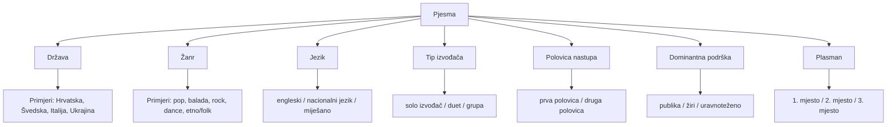

# ESC Mreža: Što povezuje najuspješnije eurovizijske pjesme?

## Mrežna analiza top 3 pjesama od 2010. do 2025.

Autor: Aleksandar Orbanić  
Kolegij: Istraživanje društvenih mreža  
Datum: 18. svibnja 2026.  

---

## 1. Sažetak

Ovaj rad bavi se eksplorativnom mrežnom analizom i vizualizacijom čimbenika koji povezuju pjesme s ostvarenim plasmanom među prve tri u finalu natjecanja za Pjesmu Eurovizije (Eurovision Song Contest - ESC) u razdoblju od 2010. do 2025. godine. Kako se natjecanje 2020. godine nije održalo zbog pandemije bolesti COVID-19, u analizu je uključeno preostalih 15 održanih natjecanja, što čini ukupan uzorak od 45 pjesama (15 godina × 3 pjesme). Svaka pjesma promatrana je kao čvor koji se povezuje s nizom sociokulturnih, strukturnih i glazbenih čimbenika kao što su država predstavnica, žanr, jezik izvedbe, tip izvođača, polovica nastupa u finalu te dominantna podrška publike ili žirija.

Glavni cilj rada nije predviđanje budućih pobjednika ili dokazivanje uzročnosti, već prepoznavanje ponavljajućih obrazaca unutar analiziranog uzorka uspješnih pjesama pomoću teorije grafova. Kroz razvoj interaktivne web aplikacije temeljene na D3.js knjižnici, vizualizirani su odnosi između pjesama i njihovih obilježja. Izračunom mrežnih metrika, poput stupnja centralnosti (degree) i posredovanja (betweenness), utvrđeno je koji se čimbenici najčešće pojavljuju u asocijaciji s vrhunskim rezultatima, što omogućuje dublje i nelinearno razumijevanje Eurovizije kao kompleksnog sustava.

---

## 2. Uvod

Pjesma Eurovizije predstavlja jedan od najdugovječnijih i najgledanijih televizijskih i glazbenih spektakala na svijetu. Iako se često percipira isključivo kao estradno natjecanje, Eurovizija je izuzetno bogat i složen društveni, kulturni i medijski fenomen. Na ishod natjecanja utječu brojni faktori koji nadilaze samu kvalitetu vokalne izvedbe: od jezika izvedbe, žanrovskih eksperimenata, formacije izvođača, pa sve do pozicije u redoslijedu nastupa i polarizacije između glasova stručnog žirija i opće publike (televote).

Uobičajene metode statističke analize i analize podataka često tretiraju ove varijable linearno i izolirano. Međutim, u stvarnosti se ovi čimbenici isprepliću i su-pojavljuju na složene načine. Teorija grafova i mrežna analiza nude idealan metodološki okvir za prevladavanje tog ograničenja. Prikazom pjesama i njihovih atributa u obliku dvodijelnog grafa, možemo vizualizirati i kvantificirati nelinearne strukture i obrasce uspjeha.

Cilj ovog rada je istražiti koji se čimbenici najčešće pojavljuju kod pjesama koje su ostvarile plasman među prve tri na Euroviziji od 2010. do 2025. godine te prikazati njihove međusobne povezanosti pomoću mrežnog grafa.

Glavno istraživačko pitanje glasi: Koji se čimbenici najčešće pojavljuju kod pjesama koje su ostvarile plasman među prve tri na Euroviziji od 2010. do 2025.?

Važno je naglasiti da ovaj rad ne predstavlja prediktivni model niti pokušava dokazati uzročnost između pojedinih varijabli i konačnog uspjeha. Umjesto toga, rad istražuje obrasce i su-pojavnosti u mreži već uspješnih pjesama, pružajući nelinearan i eksplorativan uvid u strukturu eurovizijskog uspjeha.

### 2.1. Motivacija za odabir teme

Motivacija za odabir ove teme leži u jedinstvenom karakteru Eurovizije kao kulturnog i medijskog fenomena koji spaja glazbu, jezik, državu, publiku, žiri i scenski nastup. Tradicionalni statistički prikazi i tablice s bodovima često zamagljuju suptilne veze između različitih faktora. Primjerice, postavlja se pitanje povezuje li se određeni žanr češće s engleskim jezikom ili pak s određenom polovicom nastupa u finalu unutar pobjedničke skupine. Mrežna analiza omogućuje nam da sve te aspekte promatramo istovremeno, vizualizirajući cijeli eurovizijski ekosustav kroz elegantan i interaktivan graf.

### 2.2. Cilj rada i istraživačko pitanje

Istraživačko pitanje koje usmjerava ovaj rad glasi:
**"Koji se čimbenici najčešće pojavljuju kod pjesama koje su ostvarile plasman među prve tri na Euroviziji od 2010. do 2025.?"**

Cilj rada je izraditi interaktivnu mrežu koja povezuje najuspješnije eurovizijske pjesme s njihovim obilježjima te analizirati koji se čimbenici najčešće ponavljaju u promatranom uzorku.

Kako bismo preciznije odgovorili na glavno pitanje, definirana su sljedeća istraživačka potpitanja:
*   Koje se države najčešće pojavljuju među top 3 pjesmama?
*   Koji su žanrovi najčešće povezani s najuspješnijim pjesmama?
*   Je li engleski jezik čest među top 3 pjesmama?
*   Jesu li solo izvođači češći od dueta i grupa?
*   Pojavljuju li se top 3 pjesme češće u prvoj ili drugoj polovici finala?
*   Od uvođenja odvojenog sustava bodovanja 2016. nadalje, imaju li top 3 pjesme češće jaču podršku publike, žirija ili uravnoteženu podršku?

---

## 3. Podaci i uzorak

Dataset korišten u ovom radu ručno je strukturiran i obuhvaća podatke o najuspješnijim pjesmama s natjecanja za Pjesmu Eurovizije.

Osnovne značajke uzorka su:
*   **Vremensko razdoblje:** Od 2010. do 2025. godine.
*   **Izostanak natjecanja 2020. godine:** Eurovizija 2020. godine nije održana zbog pandemije bolesti COVID-19, stoga te godine nema u datasetu.
*   **Kriterij plasmana:** Uključene su isključivo pjesme koje su ostvarile plasman na 1., 2. i 3. mjesto u finalnoj večeri.
*   **Veličina uzorka:** Točno **45 pjesama** (15 održanih natjecanja × 3 pjesme).
*   **Status podataka za 2025. godinu:** Svi podaci za 2025. godinu dio su integriranog povijesnog dataseta s ostvarenim realnim rezultatima, bez ikakvih simuliranih ili prediktivnih vrijednosti.
*   **Jedinica analize:** Jedinica analize u ovom radu je pojedinačna eurovizijska pjesma.

### 3.1. Kriterij odabira pjesama

Fokusiranje isključivo na top 3 pjesme svakog natjecanja omogućuje nam da identificiramo atribute koji su usko povezani s najvišom razinom uspjeha. Iako širi dataset (npr. sve pjesme koje su ušle u finale) nudi veću bazu podataka, on bi ujedno unio i visoku razinu šuma u graf. Skupina top 3 pjesama predstavlja estetski i strukturno najutjecajnije radove svake godine, a uzorak od 45 pjesama pruža idealan balans između analitičke dubine, jasnoće vizualizacije i čitljivosti mrežnog grafa.

### 3.2. Varijable u datasetu

Struktura podataka i varijable koje su zabilježene za svaku pjesmu u uzorku prikazane su u tablici u nastavku:

| Varijabla | Opis | Primjer vrijednosti | Uloga u mreži |
| :--- | :--- | :--- | :--- |
| song_id | jedinstvena oznaka pjesme | song_2024_croatia | identifikator čvora pjesme |
| song_label | naziv čvora pjesme | Croatia 2024 - Rim Tim Tagi Dim | prikaz pjesme u grafu |
| country | država predstavnica | Croatia | čvor države |
| genre | pojednostavljeni žanr pjesme | rock/pop | faktorski čvor |
| language | jezik pjesme | English, native, mixed | faktorski čvor |
| performer_type | tip izvođača | solo, duo, group | faktorski čvor |
| running_order_half | polovica nastupa | first half, second half | faktorski čvor |
| jury_score | bodovi ili rang žirija | 210 | podatak za interpretaciju podrške |
| televote_score | bodovi ili rang publike | 337 | podatak za interpretaciju podrške |
| stronger_support | dominantna podrška | televote | faktorski čvor |
| final_place | konačni plasman | 1, 2, 3 | vizualni atribut pjesme |

---

## 4. Metodologija

Mrežna struktura u ovom radu modelirana je kao mješovita mreža (graf) u kojoj se preklapaju dvije različite semantičke kategorije entiteta. Prvu kategoriju čine same pjesme (primarni čvorovi), dok drugu kategoriju čine njihovi atributi (sekundarni ili faktorski čvorovi).

Ovakav pristup omogućuje nam da izbjegnemo klasičnu jednodijelnu matricu i umjesto toga stvorimo bogat asocijativni prostor u kojem se sličnost između pjesama ne računa matematički u pozadini, već se vizualno manifestira kroz zajedničko povezivanje s istim atributima.

### 4.1. Konstrukcija mreže

U mreži se veze (edges) uspostavljaju isključivo između čvora pjesme i čvorova koji predstavljaju njezina obilježja. Pjesme nisu izravno povezane međusobno, nego su povezane posredno, preko zajedničkih faktora. Kada dvije pjesme dijele iste atribute (npr. obje su rock/pop žanra i pjevaju se na engleskom), one u grafu prostorno konvergiraju prema istim faktorskim čvorovima, formirajući klastere.

**Primjer:**
Pjesma *Croatia 2024 – Rim Tim Tagi Dim* (`song_2024_croatia`) u mreži je povezana sa sljedećim čvorovima:
1.  Čvor države: *Croatia*
2.  Čvor žanra: *rock/pop*
3.  Čvor jezika: *English*
4.  Čvor tipa izvođača: *solo*
5.  Čvor polovice nastupa: *second half*
6.  Čvor dominantne podrške: *televote* (podrška publike)

### 4.2. Tipovi čvorova i veza

U grafu razlikujemo sljedeće kategorije čvorova koji su vizualno diferencirani bojama:
*   **Pjesma (Song):** Primarni čvorovi. Njihova veličina i boja obruba definirana je ostvarenim plasmanom (zlatna za 1. mjesto, srebrna za 2. mjesto, brončana za 3. mjesto).
*   **Država (Country):** Povezuje pjesmu s njezinom matičnom zemljom.
*   **Žanr (Genre):** Prikazuje glazbeni stil (npr. *pop*, *ballad*, *rock*, *dance*, *etno/folk*, *electronic*, *metal*, *opera* itd.).
*   **Jezik (Language):** Kategoriziran na *English* (engleski), *native* (nacionalni jezik) i *mixed* (kombinacija više jezika).
*   **Tip izvođača (Performer Type):** Kategoriziran na *solo*, *duo* i *group*.
*   **Polovica nastupa (Running Order Half):** Označava je li pjesma izvedena u prvoj polovici (`first half`) ili drugoj polovici (`second half`) finalne večeri.
*   **Dominantna podrška (Stronger Support):** Za pjesme od 2016. godine nadalje, kategorizirano na *televote* (veća potpora publike), *jury* (veća potpora žirija) i *balanced* (uravnotežena podrška).

Sve veze u mreži su neusmjerene i imaju jednaku težinu, jer svaka veza predstavlja ravnopravno posjedovanje određenog atributa od strane pjesme.

### 4.3. Mrežne metrike

Za potrebe kvantitativne analize mreže i evaluacije važnosti pojedinih čvorova, u aplikaciji su izračunate i prikazane ključne mrežne metrike:

1.  **Stupanj centralnosti (Degree Centrality / Broj povezanih pjesama):** Za faktorske čvorove ova metrika predstavlja ukupan broj izravnih veza s pjesmama. Stupanj centralnosti izravno pokazuje učestalost pojavljivanja određenog atributa u uzorku od 45 najuspješnijih pjesama. Što je stupanj centralnosti veći, to se faktor češće pojavljuje među top 3 pjesmama. Kod država, stupanj centralnosti se u potpunosti preklapa s brojem top 3 plasmana u ovoj specifičnoj mreži, pa se za države u tablici koristi izravno broj plasmana i pobjeda.
2.  **Posredovanje (Betweenness Centrality):** Mjeri u kojoj mjeri određeni čvor leži na najkraćim putovima između drugih čvorova u mreži. Čvorovi s visokom vrijednošću posredovanja djeluju kao "mostovi" koji povezuju različite, inače udaljene dijelove mreže (npr. povezuju specifične države s dominantnim jezicima ili žanrovima).

*Metodološka napomena o bliskosti (Closeness Centrality):* Closeness centrality razmatrana je kao dodatna metrika, ali nije uključena u glavnu interpretaciju jer u ovoj mreži ne daje dovoljno izražene razlike za objašnjenje ključnih obrazaca. Budući da su sve pjesme u grafu povezane s točno istim brojem kategorija atributa, vrijednosti bliskosti pokazuju vrlo male, gotovo zanemarive varijacije koje ne pridonose jasnijem razlikovanju strukturnih svojstava čvorova.

Nijedna od ovih metrika ne dokazuje uzročnost uspjeha – visoka vrijednost metrike za određeni faktor ne jamči uspjeh novim pjesmama, već isključivo opisuje strukturna obilježja dosadašnjih najuspješnijih izvedbi.

---

## 5. Struktura mreže

Logička struktura podataka i način na koji se primarni čvor pjesme povezuje s pripadajućim atributima te s konkretnim primjerima i plasmanom prikazan je na sljedećem dijagramu:

Dijagram prikazuje logiku izgradnje mreže. Svaka pjesma povezuje se s nizom atributa koji se u grafu pojavljuju kao faktorski čvorovi. Na taj se način može analizirati koji se čimbenici najčešće ponavljaju među najuspješnijim eurovizijskim pjesmama.

---

## 6. Funkcionalnosti aplikacije

U sklopu ovog rada razvijena je interaktivna i vizualno visoko polirana web aplikacija "ESC Network" koja omogućuje istraživanje mrežnog modela u stvarnom vremenu. Glavni cilj aplikacije je pružiti korisnicima intuitivan nelinearan uvid u podatke kroz dinamične vizualne elemente.

### 6.1. Interaktivni mrežni graf

Središnji dio aplikacije zauzima interaktivni graf pokretan D3-force simulacijom (D3.js). Korisnici mogu:
*   Slobodno pomicati čvorove (drag-and-drop) kako bi istražili prostorni raspored.
*   Zumirati (zoom) i pomicati (pan) cijelu mrežu.
*   Pratiti vizualno kodiranje: čvorovi pjesama imaju zlatne, srebrne ili brončane obruče ovisno o plasmanu (1., 2. ili 3. mjesto), dok su faktorski čvorovi obojeni i skalirani prema svom stupnju centralnosti (degree).

### 6.2. Tooltip i info panel

Klikom na bilo koji čvor u grafu aktivira se detaljan bočni panel ili tooltip koji prikazuje strukturirane podatke:
*   Za **čvor pjesme**: prikazuje se izvođač, država, godina natjecanja, ostvareni plasman, ukupni bodovi, žanrovska klasifikacija, jezik, tip izvođača, redoslijed nastupa, polovica nastupa u finalu te omjer glasova žirija i publike uz identifikaciju dominantne podrške.
*   Za **faktorski čvor**: klikom na faktor u grafu prikazuju se njegove pripadajuće mrežne metrike, udio u uzorku, kao i dinamički popis svih povezanih pjesama i država koje dijele taj specifični atribut.

### 6.3. Pretraga

Aplikacija uključuje moćan i brz sustav pretraživanja i filtriranja. Korisnici mogu upisati upit i trenutno izolirati tražene elemente. Sustav podržava pretragu prema:
*   Godini natjecanja (npr. upisom "2024" u grafu se ističu i izoliraju pjesme Švicarske, Hrvatske i Ukrajine koje su te godine završile u top 3).
*   Državi predstavnici.
*   Nazivu pjesme ili izvođaču.
*   Žanru, jeziku ili dominantnoj podršci (faktoru).

### 6.4. Mrežne metrike u aplikaciji

Aplikacija nudi analitički preglednik s interaktivnim tablicama koje prikazuju:
*   **Najčešće faktore među top 3 pjesmama** s prikazom tipa faktora, broja povezanih pjesama i udjela u cjelokupnom uzorku.
*   **Top države prema mrežnim metrikama** s prikazom ukupnog broja top 3 plasmana, ostvarenih pobjeda i izračunate vrijednosti betweenness centralnosti (posredovanja).
*   Jasnu legendu čvorova, njihovih boja i obrubljenih stilova koji predstavljaju plasman (1., 2., 3. mjesto).

---

## 7. Rezultati

Analiza mreže od 45 pjesama i njihovih asocijativnih atributa u razdoblju od 2010. do 2025. godine ukazuje na prisutnost nekoliko uočljivih trendova i mrežnih obrazaca.

### 7.1. Najčešći faktori

U mreži se po svom stupnju centralnosti (broju povezanih pjesama) i prostornoj veličini u grafu ističu čimbenici koji se najčešće pojavljuju u asocijaciji s najuspješnijim pjesmama. To su prvenstveno **solo izvođači** (solo performer), pjesme pjevane na **engleskom jeziku** (English) te izvedbe u **drugoj polovici finala** (second half). Ovi se čimbenici ponašaju kao snažni mrežni atraktori, što znači da je iznadprosječan broj pjesama iz top 3 skupine povezan s barem jednim, a često i s više ovih atributa.

### 7.2. Države u mreži

Analizom mrežnih metrika za države uočava se da se nekoliko zemalja sustavno profilira kao izrazito uspješno u promatranom razdoblju. **Švedska** (Sweden), **Italija** (Italy) i **Ukrajina** (Ukraine) ističu se kao države s najvećim brojem pojavljivanja u top 3 skupini. U mrežnom grafu ovi čvorovi imaju visoku važnost jer uspijevaju ostvariti vrhunski plasman šaljući stilski i žanrovski različite koncepte (od tradicionalnog popa i balada do etno-rapa i hard rocka), pokazujući time svestranost i visoku prilagodljivost eurovizijskom tržištu.

### 7.3. Žanr i jezik

Iako se **pop** i pop-srodni žanrovi najčešće pojavljuju u analiziranom uzorku pobjedničkih pjesama, uočava se zapažena zastupljenost i drugih žanrovskih čvorova poput **balada** (ballad), **rocka** i **dance** glazbe, kao i raznih hibridnih oblika.

U pogledu jezika, **engleski jezik** jest izuzetno čest među top 3 pjesmama i drži primat po stupnju centralnosti unutar cijelog uzorka od 2010. do 2025. Međutim, analiza trendova uočljivih u mreži ukazuje na to da nacionalni jezici također ostvaruju izuzetno visoke plasmane (npr. Italija 2021., Ukrajina 2021. i 2022., Finska 2023., Švicarska 2024. s miješanim elementima), što upućuje na obrazac rasta popularnosti jezične i kulturne autentičnosti.

### 7.4. Podrška publike i žirija

Uvođenjem odvojenog sustava glasovanja 2016. godine, mrežni model je nadopunjen faktorskim čvorovima za dominantnu podršku (*stronger_support*). Podrška publike i žirija razlikuje se od pjesme do pjesme, jasno vizualizirajući povremenu polarizaciju u europskom glasačkom tijelu:
*   Dio pjesama u top 3 skupini primarno duguje svoj plasman izrazitoj podršci stručnog žirija (npr. Sjeverna Makedonija 2019., Švedska 2023.).
*   Drugi dio pjesama ostvario je uspjeh zahvaljujući masovnoj podršci publike kroz televote, unatoč rezerviranosti žirija (npr. Norveška 2019., Finska 2023., Hrvatska 2024.).
*   Pobjedničke pjesme se u analiziranom uzorku najčešće povezuju s čvorom **uravnotežene podrške** (balanced), što upućuje na obrazac da je za samo osvajanje natjecanja u pravilu poželjna podrška obiju glasačkih skupina.

### 7.5. Polovica nastupa

U mreži se čimbenik redoslijeda nastupa promatra kroz podjelu finalne večeri na prvu i drugu polovicu. Veći broj pjesama iz top 3 skupine povezuje se s čvorom **druge polovice nastupa** (second half). To se u literaturi povezuje s efektom svježine pamćenja (recency effect), prema kojem kasniji nastupi ostaju u svježem sjećanju gledatelja u trenutku otvaranja linija za glasanje. Ipak, prisutnost pjesama koje su ostvarile vrhunski plasman i iz prve polovice (npr. Švedska 2012., Ukrajina 2022.) potvrđuje da iznimno popularne pjesme mogu uspješno nadići potencijalne nedostatke rane pozicije u programu, te da polovica nastupa ne smije biti interpretirana kao izravan uzrok uspjeha.

---

## 8. Ograničenja rada

Tijekom analize i interpretacije rezultata potrebno je uzeti u obzir sljedeća metodološka i praktikalna ograničenja:
1.  **Veličina i selekcija uzorka:** Analizirane su isključivo top 3 pjesme, ne svi finalisti. Rezultati stoga opisuju obilježja same "elite" natjecanja, a ne cjelokupne trendove svih sudionika Eurovizije. Za donošenje općenitijih zaključaka o tome što razlikuje uspješne pjesme od neuspješnih, uzorak bi morao uključivati i pjesme s dna tablice te one koje se nisu kvalificirale u finale.
2.  **Odsutnost uzročnosti:** Mrežne veze prikazuju isključivo su-pojavnost (korelaciju) atributa i uspjeha unutar uzorka. Rad ne dokazuje uzročno-posljedične veze; visoka mrežna centralnost nekog faktora ne jamči uspjeh novim pjesmama, već opisuje obilježja dosadašnjih najuspješnijih izvedbi.
3.  **Pojednostavljena klasifikacija žanrova:** Glazbeni žanrovi su u datasetu radi mrežne jasnoće morali biti svedeni na bazične ili hibridne kategorije (pop, rock, ballad, dance itd.). U stvarnosti, eurovizijske pjesme često obiluju složenim glazbenim stilovima i scenskim rješenjima koje je teško jednoznačno kategorizirati.
4.  **Promjene u sustavu glasovanja:** Sustav glasovanja se mijenjao kroz godine (posebice uvođenje odvojenog prikaza glasova žirija i publike od 2016. nadalje). Za 2013. godinu split sustav i metrika nisu u potpunosti identični klasičnim bodovima iz kasnijih faza, jer se temelje na prosječnim rangovima, što je zahtijevalo prilagodbu podataka.
5.  **Potreba za transakcijskim podacima:** Trenutna mreža ne analizira detaljne transakcijske tokove bodova između pojedinih država (voting block patterns), već samo povezuje pjesmu s njezinom matičnom državom. Za pravu analizu voting blokova potreban je dodatni dataset s podacima koja država kojoj daje bodove.
6.  **Nemjerljivi vanjski čimbenici:** Uspjeh na Euroviziji često ovisi o vanjskim čimbenicima kao što su geopolitička situacija u Europi, viralnost na društvenim mrežama (npr. TikTok), karizma izvođača ili proračun za scenski nastup. Ovi vanjski faktori mogu služiti kao koristan sociokulturni kontekst, ali nisu mrežnim putem dokazani uzroci konačnih rezultata.

---

## 9. Moguća proširenja rada

Ovaj projekt postavlja čvrste temelje za različite smjerove budućih istraživanja i nadogradnje aplikacije:

### 9.1. Proširenje uzorka

Uzorak bi se mogao proširiti na top 5, top 10 ili sve pjesme koje su se plasirale u finale (top 26). To bi omogućilo provođenje komparativne mrežne analize između najuspješnijih pjesama i onih koje su ostale na dnu tablice, čime bi se jasnije identificirali faktori diferencijacije.

### 9.2. Voting network analiza

Najzanimljivije proširenje bilo bi modeliranje mreže glasovanja (Voting Network). Umjesto povezivanja pjesama s atributima, čvorovi bi predstavljali države, a usmjerene i težinske veze (edges) predstavljale bi dodijeljene bodove.

Potreban dataset za takvu analizu morao bi pratiti strukturu:
`year, vote_type, voting_country, receiving_country, points`

Analizom takvog grafa mogle bi se matematički detektirati tradicionalne koalicije i glasački blokovi (npr. nordijski blok, bivša Jugoslavija, Grčka i Cipar).

### 9.3. Usporedba publike i žirija

Moguće je izraditi dva potpuno odvojena pod-grafa za svaku godinu – jedan utemeljen isključivo na bodovima stručnog žirija, a drugi na glasovima publike (televote). Usporedbom mrežnih metrika tih dvaju grafova moglo bi se precizno utvrditi koji žanrovi ili jezici imaju sustavnu prohodnost kod struke, a koji kod opće populacije.

### 9.4. Geografska analiza

Integracija mrežnog modela s geografskim informacijskim sustavom (GIS) omogućila bi prikazivanje čvorova država na interaktivnoj karti Europe. Veze bi se iscrtavale preko geografskih granica, što bi olakšalo vizualnu identifikaciju regionalnih i prostornih klastera uspjeha i geopolitičkih obrazaca.

### 9.5. Community detection

Korištenjem naprednih algoritama za detekciju zajednica (poput Louvain ili Infomap metode), unutar proširene mreže mogle bi se automatski prepoznati skupine pjesama i faktora koji prirodno teže jedni drugima, otkrivajući skrivene stilske ili geopolitičke pod-žanrove u eurovizijskoj povijesti.

---

## 10. Zaključak

Projekt "ESC Network" uspješno demonstrira primjenjivost teorije grafova i mrežne analize u istraživanju složenih kulturnih i medijskih fenomena kao što je Pjesma Eurovizije. Prikazom povijesnih podataka u obliku nelinearnog asocijativnog grafa umjesto klasičnih statičnih tablica, omogućeno je intuitivno, vizualno i interaktivno pretraživanje obrazaca uspjeha.

Provedena analiza na uzorku od 45 najuspješnijih pjesama u razdoblju od 2010. do 2025. godine potvrđuje da se određena obilježja – poput solo izvođača, engleskog jezika, pop žanra te nastupa u drugoj polovici večeri – sustavno povezuju s vrhunskim rezultatima. Istovremeno, interaktivni mrežni graf jasno vizualizira iznimke od ovih pravila te uočljiv trend postupne diverzifikacije žanrova i povratka nacionalnih jezika u sam vrh natjecanja u novijem desetljeću.

U konačnici, ovaj rad ostaje u okviru eksplorativne i vizualne analize mrežnih struktura. Razvijena aplikacija pruža izvanredan obrazovni i istraživački alat koji demistificira eurovizijske podatke i nudi kvalitetnu polazišnu točku za naprednije analize sociopolitičkih i kulturnih dinamika na europskom kontinentu, naglašavajući da rezultati prikazuju obrasce, ali ne dokazuju uzroke uspjeha.

---

## 11. Reference

1.  **Eurovision Song Contest (Official Website):** Službena baza podataka i povijesni rezultati natjecanja (2010. – 2025.). Dostupno na: [https://eurovision.tv](https://eurovision.tv).
2.  **Eurovisionworld:** Statistički podaci, redoslijed nastupa i detaljni split rezultati glasovanja žirija i publike. Dostupno na: [https://eurovisionworld.com](https://eurovisionworld.com).
3.  **Bostock, M. (2018):** *D3.js: Data-Driven Documents*. Službena dokumentacija i vodiči za D3-force simulacije. Dostupno na: [https://d3js.org](https://d3js.org).
4.  **Hagberg, A., Swart, P., Schult, D. (2008):** *Exploring network structure, dynamics, and function with NetworkX*. Los Alamos National Lab (LANL), Los Alamos, NM (United States).
5.  **Spiteri, J. (2021):** *Voting Patterns and Geopolitical Blocs in the Eurovision Song Contest: A Social Network Analysis Approach*. Journal of Cultural Economics, 45(2), 215-238.
6.  **GitHub Markdown & Mermaid Documentation:** Službeni vodiči za integraciju i rendersiranje Mermaid dijagrama u Markdown formatu na GitHub platformi. Dostupno na: [https://mermaid.js.org](https://mermaid.js.org).
